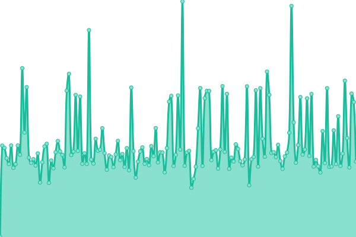
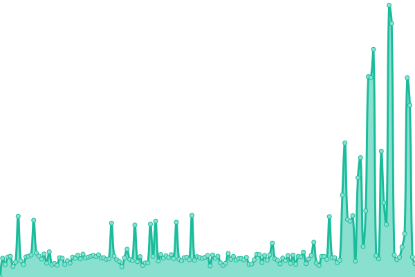

# [📈 Live Status](https://status.nakn.jp): <!--live status--> **🟩 All systems operational**

This repository contains the open-source uptime monitor and status page for [naknjp](https://status.nakn.jp), powered by [Upptime](https://github.com/upptime/upptime).

With [Upptime](https://upptime.js.org), you can get your own unlimited and free uptime monitor and status page, powered entirely by a GitHub repository. We use [Issues](https://github.com/naknjp/status-page/issues) as incident reports, [Actions](https://github.com/naknjp/status-page/actions) as uptime monitors, and [Pages](https://status.nakn.jp) for the status page.

<!--start: status pages-->
<!-- This summary is generated by Upptime (https://github.com/upptime/upptime) -->
<!-- Do not edit this manually, your changes will be overwritten -->
<!-- prettier-ignore -->
| URL | Status | History | Response Time | Uptime |
| --- | ------ | ------- | ------------- | ------ |
|  [なりかくんのブログ](https://narikakun.net) | 🟩 Up | [.yml](https://github.com/Narikakun-Network/status-page/commits/HEAD/history/.yml) | 

 2107ms
     
 | 

<a href="https://status.nakn.jp/history/">100.00%</a>
    

|  [ur0.cc](https://ur0.cc) | 🟩 Up | [ur0-cc.yml](https://github.com/Narikakun-Network/status-page/commits/HEAD/history/ur0-cc.yml) | 

 975ms
     
 | 

<a href="https://status.nakn.jp/history/ur0-cc">100.00%</a>
    

|  [nTool.online](https://ntool.online) | 🟩 Up | [n-tool-online.yml](https://github.com/Narikakun-Network/status-page/commits/HEAD/history/n-tool-online.yml) | 

 744ms
     
 | 

<a href="https://status.nakn.jp/history/n-tool-online">100.00%</a>
    

|  [Narikakun Free Fileupload](https://pfile.narikakun.net/i/us0akk055bpywvwv9wnpw6ov) | 🟩 Up | [narikakun-free-fileupload.yml](https://github.com/Narikakun-Network/status-page/commits/HEAD/history/narikakun-free-fileupload.yml) | 

 3173ms
     
 | 

<a href="https://status.nakn.jp/history/narikakun-free-fileupload">100.00%</a>
    

<!--end: status pages-->

[**Visit our status website →**](https://status.nakn.jp)

## 📄 License

- Powered by: [Upptime](https://github.com/upptime/upptime)
- Code: [MIT](./LICENSE) © [naknjp](https://status.nakn.jp)
- Data in the `./history` directory: [Open Database License](https://opendatacommons.org/licenses/odbl/1-0/)
